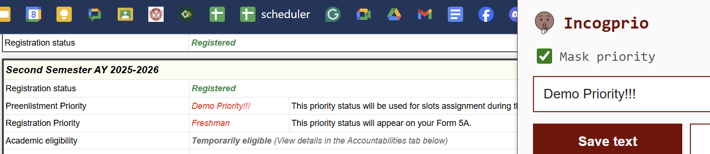

# IncogPrio

A browser extension to mask priorities in CRS. A privacy extension that allows you to hide your priority in public.

## Browser Support 

- Chrome/Chromium browsers
- Firefox/Zen soon

## Installation

1. Install this Github repo
2. Go to `chrome://extensions
3. Select `Load unpacked` and look for the Github repo
4. Installation done! Try it out in UPD CRS!

## Disclaimers

The effects are purely visual (for privacy purposes). This does *not* change your true priority.

MIT License © 2026 mortrpestl